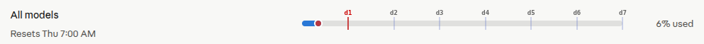

# Claude Usage Timeline Overlay

A Tampermonkey / Violentmonkey userscript that draws a **day-by-day timeline** on top of the progress bars on [claude.ai/settings/usage](https://claude.ai/settings/usage).

At a glance you can see:

- where you are in the current reset window (red dot),
- which day of the period you are on (highlighted tick + label),
- how many days are left before the next reset.

Handy for the weekly and monthly quotas where "6% used, resets Thu 7:00 AM" doesn't quite tell you whether you're burning through your allowance too fast.

## Preview

The weekly bar above shows day 1 of 7 (red tick = today), with the red dot marking the current time inside the reset window.

## Install

1. Install a userscript manager:
   - [Tampermonkey](https://www.tampermonkey.net/) (Chrome, Edge, Firefox, Safari)
   - [Violentmonkey](https://violentmonkey.github.io/) (Chrome, Firefox)
2. Click to install:

   👉 **[Install claude-usage-timeline.user.js](https://raw.githubusercontent.com/radimklaska/claude-usage-timeline/main/claude-usage-timeline.user.js)**

   Your userscript manager should pick up the `.user.js` URL and offer to install it. Auto-updates are wired through `@updateURL`, so you'll get new versions automatically.
3. Open [claude.ai/settings/usage](https://claude.ai/settings/usage) — the overlay appears on each progress bar that has a parseable "Resets …" label.

## What it overlays

The script parses the reset text shown next to each progress bar and picks a period accordingly:

| Reset text                  | Period assumed   | What's drawn                                       |
| --------------------------- | ---------------- | -------------------------------------------------- |
| `Resets in 2 hr 15 min`     | 5 hours (session) | Current-time dot only (period is too short for day ticks) |
| `Resets Thu 7:00 AM`        | 7 days (weekly)  | `d1` … `d7` ticks + current-time dot               |
| `Resets Jun 1`              | ~1 month         | `d1` … `dN` ticks + current-time dot               |

Colors:

- **Blue ticks / `dN` labels** — day boundaries
- **Red tick + `dN`** — the day you are currently in
- **Red dot on the bar** — the exact current time within the reset window

## How it works

- Watches the page with a `MutationObserver` because the usage screen re-renders as counters update.
- Refreshes every 60 s so the "now" dot stays accurate even if nothing changes on the page.
- Pure DOM — no network calls, no storage, no permissions beyond `@match https://claude.ai/settings/usage*`.

## Development

The whole thing is a single file: [`claude-usage-timeline.user.js`](claude-usage-timeline.user.js).

To hack on it locally:

1. Open the userscript in your manager's editor (or point the manager at a local file with file-watching).
2. Reload `claude.ai/settings/usage`.

If Claude's DOM changes and the script stops finding the reset text, the place to look is `processAllBars()` — it walks three parents up from each `[role="progressbar"]` to find the row containing the `Resets …` span.

## License

MIT — do whatever you want, no warranty.
